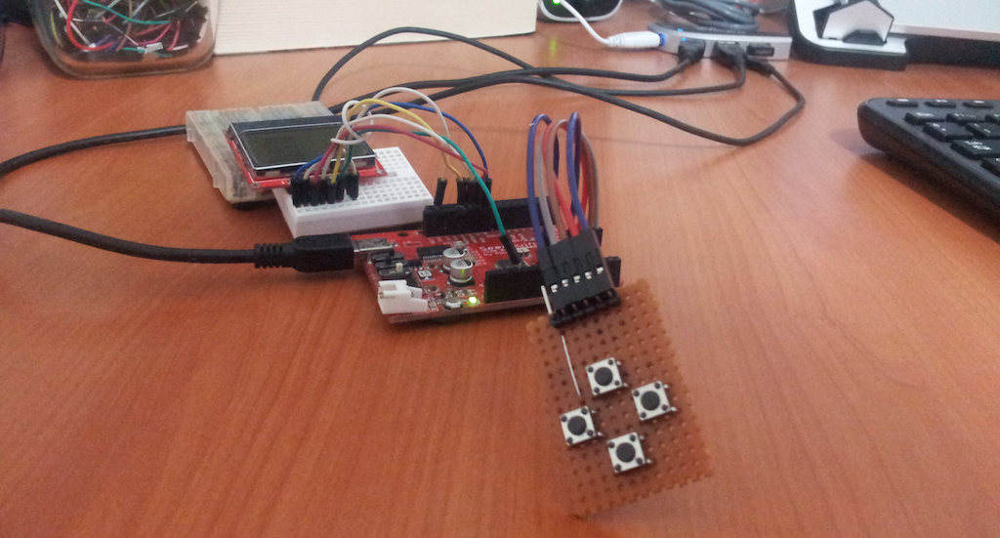

#lcdMenu - v0.1

Portable text based lcd menu library written in C. You can see the library in action in this [video](./m328p_example.mov).

##Porting

You have to submit 4 functions to this library. 

#####`void lcdMenu_goNextLine();`
Moves the text cursor of the LCD to begining of the next line.

#####`void lcdMenu_clearScreen();`
Clears the screen and moves the cursor to the (0,0) location of the LCD.

#####`void lcdMenu_printNormal(const char* message);`
Prints a line of text to LCD's current line. 

#####`void lcdMenu_printSpecial(const char* message);`
Prints a line of text to LCD's current line with a special format. For example, text color could be inverted or a prefix like `> ` can be added to the text.

##Usage

After you assign your platform spesific functions to the lcdMenu library, you should also add some kind of button - action mechanism on your main code as well. 

Moreover, you should also define your menu and item elements and their structural relationship on your code. 

`m328p_example` can be used as a reference.

##TODO

The library currently uses standard SRAM based variable definitions for menu informations. This can be a bit problematic in small RAM based devices. In order to solve this problem, I'll be creating an AVR spesific PROGMEM based version of this library when I needed.